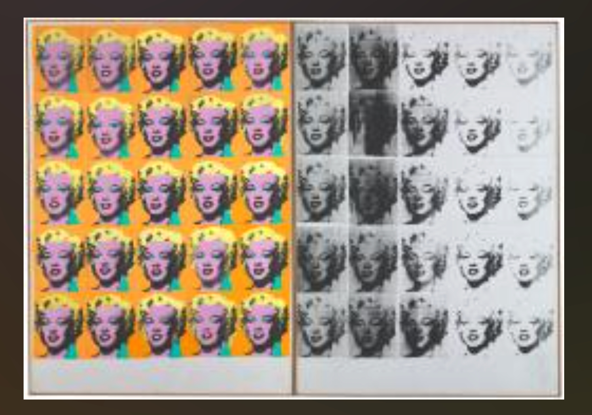
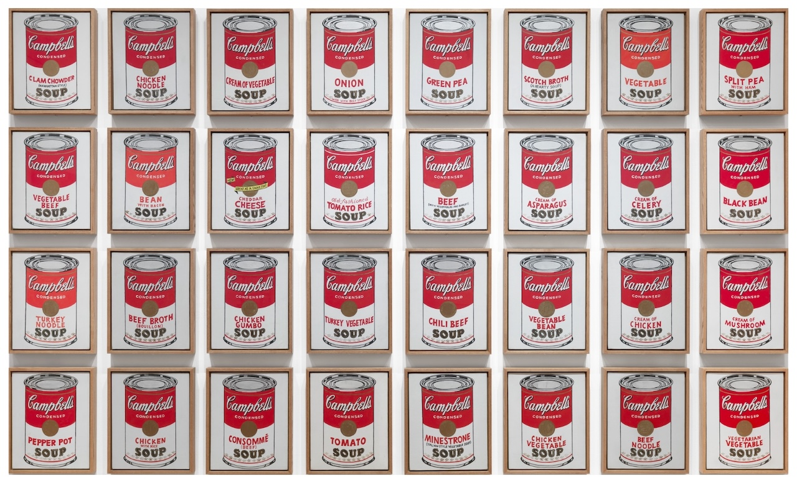
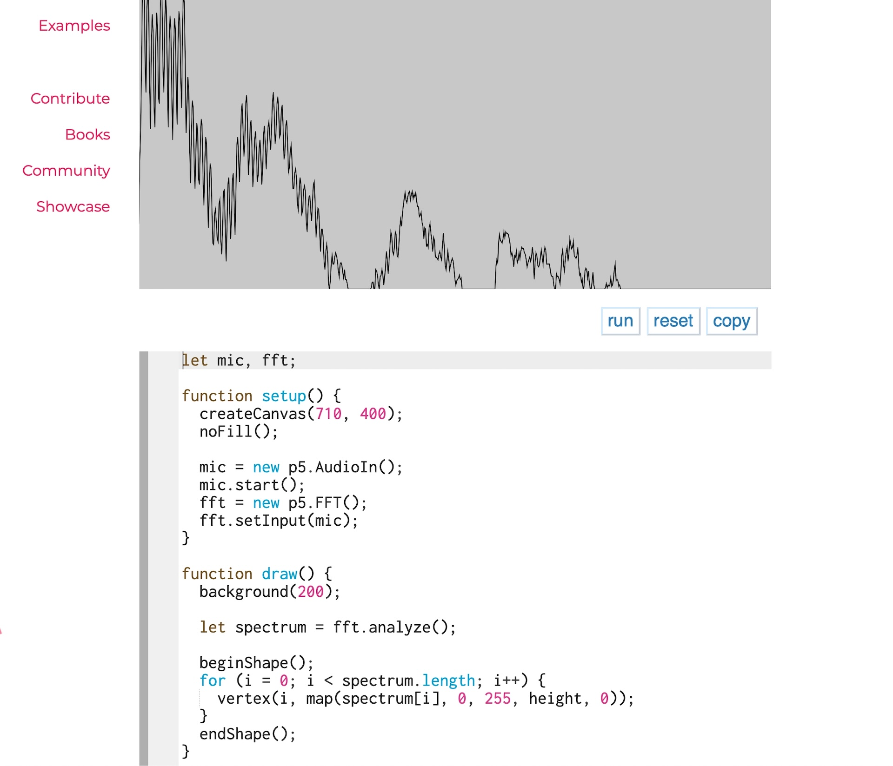

# Quiz 8

## Part 1: Imaging Technique Inspiration

### Pop Art Repetition and Variation

Sources:  
[Tate – Marilyn Diptych](https://www.tate.org.uk/art/artworks/warhol-marilyn-diptych-t03093)  
[MoMA – Campbell's Soup Cans](https://www.moma.org/collection/works/79809)

I am inspired by Andy Warhol’s Pop Art use of repetition and variation, especially *Marilyn Diptych* and *Campbell’s Soup Cans*. Warhol repeats similar images, but each version feels different through colour, arrangement, and surface quality. I would like to incorporate this structure into our project by dividing one image into four repeated panels, with each panel controlled by a different technique: audio, time-based change, Perlin noise/randomness, and user input. This is useful because it makes technical differences visually clear while keeping the whole project unified through one repeated Pop Art-style composition.

## Part 2: Coding Technique Exploration

### Audio-Reactive Visualisation with Microphone Input and FFT

Example code: [p5.js Frequency Spectrum](https://archive.p5js.org/examples/sound-frequency-spectrum.html)  
Related inspiration: [The Jellyfish VR soundscape](https://www.vrham.de/en/the-jellyfish/)

The coding technique I want to explore is audio-reactive visualisation using microphone input and FFT analysis. In p5.js, `p5.AudioIn()` can capture live sound, `getLevel()` can measure loudness, and `p5.FFT()` can analyse different frequency ranges. This could help my Pop Art-inspired panel respond directly to music or voice. For example, louder sound could increase image size, brightness, or distortion, while low and high frequencies could affect different colours or shapes. This technique would make the audio panel feel alive and connected to the surrounding environment.
